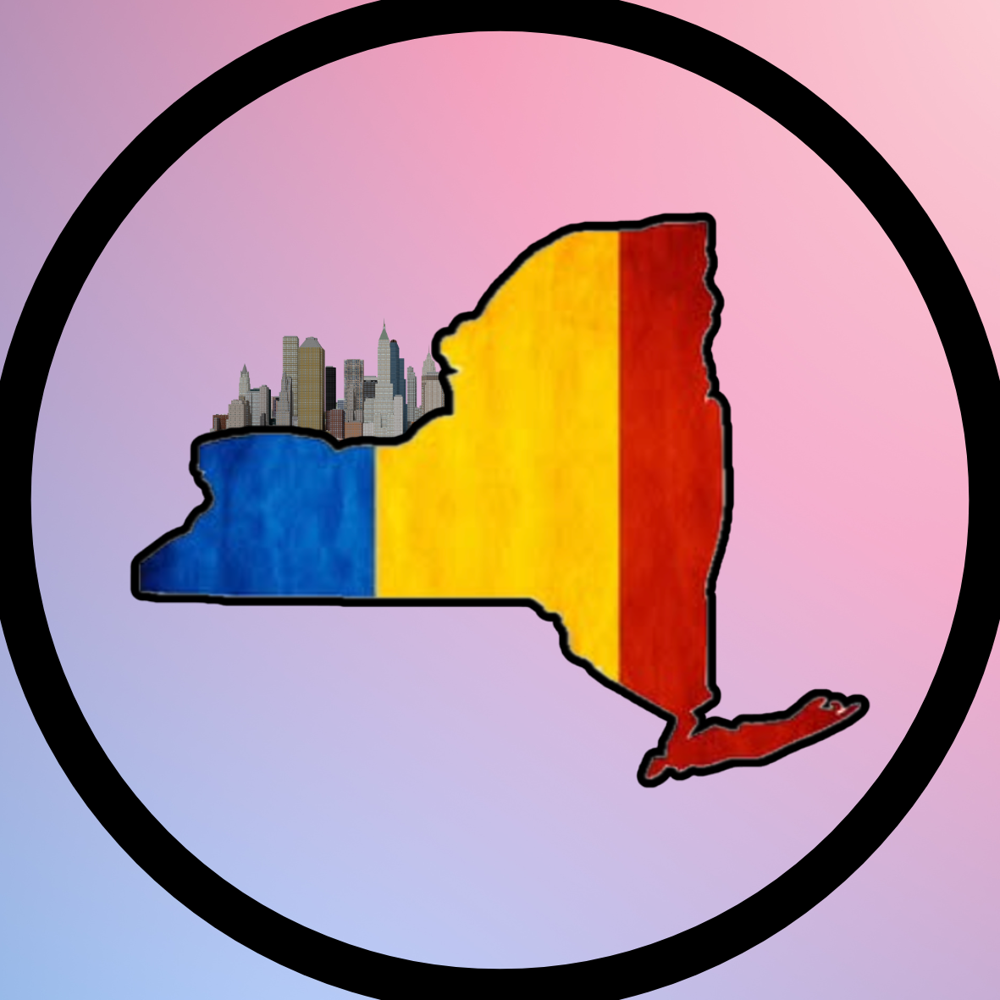

<section class="hero banner-hero">
  <!-- Homepage banner image shown above welcome text -->
  

  

    <h1>Welcome!</h1>
    

      NYRG is a community for Romanians in New York. We host meetups,
      share resources, and connect people through mentorship.
    

  

</section>

<!--
  Rotating photos section
  - Replace image URLs in data-image-url with your event photos.
  - Keep at least 2 slides for visible rotation.
-->
<section class="photo-rotator card" aria-label="Featured community photos">
  <h2>Featured Photos</h2>

  

    
  

  <!--
    Slide definitions for collaborators.
    Edit only data-image-url and data-caption.
  -->
  

    

    

    

  

  

    <button class="btn" id="hero-rotator-prev" type="button" aria-label="Show previous photo">Previous</button>
    
Skyline meetup moments

    <button class="btn" id="hero-rotator-next" type="button" aria-label="Show next photo">Next</button>
  

</section>

<section class="grid">
  <!-- =========================
       LEFT CARD: INSTAGRAM
       ========================= -->
  

    <h2>Latest from Instagram</h2>
    

      Follow
      <a href="https://www.instagram.com/newyorkromaniangroup/" target="_blank" rel="noopener">
        @newyorkromaniangroup
      </a>
      for event announcements and updates.
    

    

      <a class="btn-ig" href="https://www.instagram.com/newyorkromaniangroup/" target="_blank" rel="noopener">
        Follow on Instagram
      </a>

      

    

    

      <blockquote
        class="instagram-media"
        data-instgrm-permalink="https://www.instagram.com/newyorkromaniangroup/"
        data-instgrm-version="14"
        style="margin: 0 auto; max-width: 540px; min-width: 280px;"
      ></blockquote>
    

    

      

        Latest 3 posts (auto-updated). If embeds are blocked,
        use the links below.
      

      

      

        

      

    

  

  <!-- =========================
       RIGHT CARD: PHOTO GALLERY
       ========================= -->
  

    <h2>Photo Highlights</h2>
    
Browse the full shared folder and open individual files below.

    

      <!--
        Shared Google Drive folder embed.
        Replace only the folder ID after /folders/ to switch folders.
      -->
      <iframe
        src="https://drive.google.com/drive/u/2/folders/1qHFOROkuAI5sICLSSxj0Bg_b5QxqTp4u"
        height="520"
        loading="lazy"
        title="NYRG Photo Highlights"
      ></iframe>

      

        To update this gallery, keep the URL format and replace only the folder ID.
      

    

    

      <a class="btn" href="https://drive.google.com/drive/folders/1qHFOROkuAI5sICLSSxj0Bg_b5QxqTp4u?usp=sharing" target="_blank" rel="noopener">
        Open Shared Folder
      </a>
    

  

</section>

<section style="padding-bottom: 36px;">
  <iframe
    data-testid="embed-iframe"
    style="border-radius:12px"
    src="https://open.spotify.com/embed/playlist/0QDUXCzu4fLHWrDSP9sxpJ?utm_source=generator&theme=0"
    width="90%"
    height="352"
    frameBorder="0"
    allowfullscreen=""
    allow="autoplay; clipboard-write; encrypted-media; fullscreen; picture-in-picture"
    loading="lazy"
    title="NYRG Spotify playlist"
  ></iframe>
</section>
